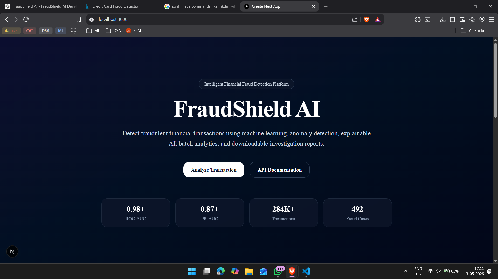
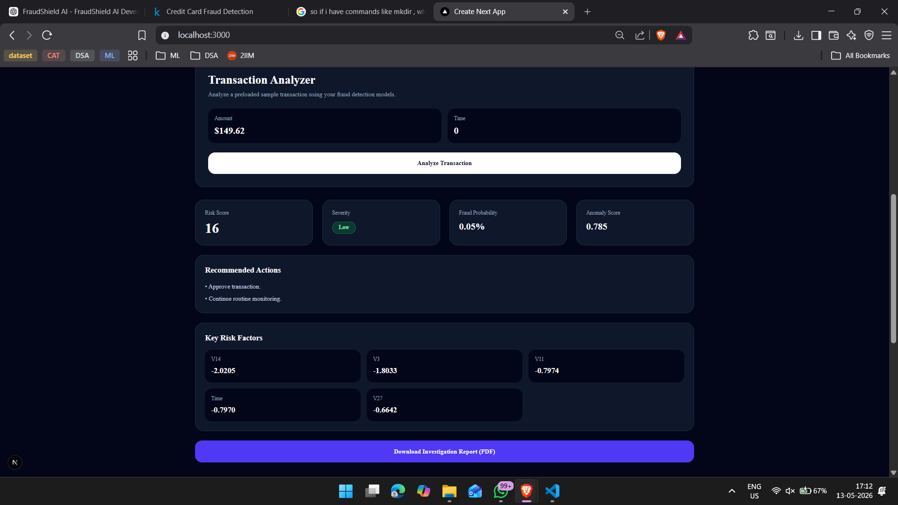
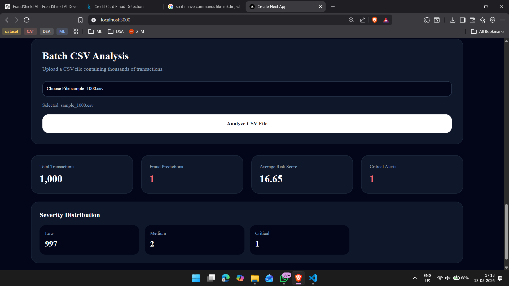
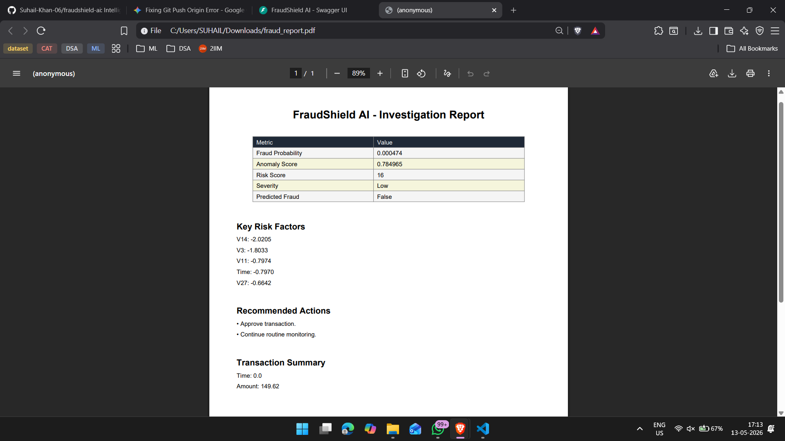

# FraudShield AI 🛡️

> Intelligent Financial Fraud Detection Platform powered by Machine Learning, Anomaly Detection, Explainable AI, and Full-Stack Analytics.


---

## 🚀 Overview

FraudShield AI is a production-style fraud intelligence platform that detects suspicious credit card transactions using:

- **Supervised Machine Learning** with XGBoost
- **Anomaly Detection** with Isolation Forest
- **Explainable AI** with SHAP
- **Risk Scoring Engine** (0–100)
- **Investigator-Style PDF Reports**
- **CSV Batch Analysis**
- **Modern Full-Stack Dashboard**

The system analyzes single transactions or bulk CSV uploads and returns actionable fraud insights, severity levels, recommendations, and downloadable reports.

---

## ✨ Features

### 🔍 Intelligent Fraud Detection

- Predicts fraud probability for individual transactions
- Uses XGBoost trained on real-world financial fraud data
- Handles severe class imbalance effectively

### 🧠 Anomaly Detection

- Detects unusual behavioral patterns with Isolation Forest
- Helps identify previously unseen fraud strategies

### 📊 Risk Scoring Engine

- Converts model outputs into a 0–100 risk score
- Maps scores to Low, Medium, High, and Critical severity levels

### 🔎 Explainable AI

- Uses SHAP to identify the most influential features
- Provides transparent, investigator-friendly explanations

### 📄 PDF Investigation Reports

- Generates downloadable fraud investigation reports
- Includes scores, explanations, and recommended actions

### 📁 Batch CSV Analysis

- Processes thousands of transactions at once
- Returns aggregate statistics and severity distributions

### 💻 Full-Stack Dashboard

- Built with Next.js, TypeScript, and Tailwind CSS
- Responsive SaaS-style interface

---

## 🏗️ System Architecture

```text
Transaction Input (Single or CSV)
                ↓
        XGBoost Classifier
                ↓
      Isolation Forest Detector
                ↓
         Risk Scoring Engine
                ↓
         SHAP Explainability
                ↓
  PDF Reports / Analytics Dashboard
```

---

## 🧪 Model Performance

|          Metric |  Score |
| --------------: | -----: |
|         ROC-AUC | 0.9805 |
|          PR-AUC | 0.8760 |
| Fraud Precision | 85.42% |
|    Fraud Recall | 83.67% |
|  Fraud F1-Score | 84.54% |

---

## 📊 Sample Output

```json
{
  "is_fraud": false,
  "fraud_probability": 0.000474,
  "anomaly_score": 0.784965,
  "risk_score": 16,
  "severity": "Low",
  "recommendations": ["Approve transaction.", "Continue routine monitoring."],
  "key_risk_factors": [
    {
      "feature": "V14",
      "impact": -2.0205
    }
  ]
}
```

---

## 🧰 Tech Stack

### Backend

- Python 3.11+
- FastAPI
- XGBoost
- Scikit-learn
- SHAP
- Pandas
- NumPy
- ReportLab
- Joblib

### Frontend

- Next.js 15
- TypeScript
- Tailwind CSS
- Axios
- shadcn/ui
- Recharts
- Framer Motion

### Dataset

- Kaggle Credit Card Fraud Detection Dataset

---

## 📁 Project Structure

```text
fraudshield-ai/
├── backend/
│   ├── api/
│   ├── services/
│   └── training/
├── frontend/
│   ├── src/app/
│   ├── src/components/
│   └── src/lib/
├── data/
├── models/
├── screenshots/
├── requirements.txt
└── README.md
```

---

## 📸 Screenshots

> Add your screenshots to the `screenshots/` folder and keep the filenames below.

### Landing Page



### Single Transaction Analysis



### Batch CSV Analysis



### PDF Investigation Report



---

## 📦 Dataset

This project uses the Kaggle Credit Card Fraud Detection Dataset:

https://www.kaggle.com/datasets/mlg-ulb/creditcardfraud

### Dataset Summary

- 284,807 transactions
- 492 fraudulent transactions
- 30 numerical features
- Highly imbalanced dataset

---

## ⚙️ Installation

### 1. Clone the Repository

```bash
git clone https://github.com/Suhail-Khan-06/fraudshield-ai.git
cd fraudshield-ai
```

### 2. Backend Setup

```bash
python -m venv .venv
```

#### Windows

```bash
.venv\Scripts\activate
```

#### macOS/Linux

```bash
source .venv/bin/activate
```

```bash
pip install -r requirements.txt
uvicorn backend.api.main:app --reload
```

Backend will be available at:

- http://localhost:8000
- http://localhost:8000/docs

### 3. Frontend Setup

```bash
cd frontend
npm install
npm run dev
```

Frontend will be available at:

- http://localhost:3000

---

## 🧠 Train the Models

```bash
python backend/training/train.py
```

This generates:

- `models/xgboost_model/xgboost_model.joblib`
- `models/anomaly_detector/isolation_forest.joblib`
- `models/feature_columns.joblib`

---

## 🔌 API Endpoints

| Method | Endpoint              | Description                  |
| ------ | --------------------- | ---------------------------- |
| GET    | `/`                   | Health check                 |
| POST   | `/api/v1/predict`     | Predict a single transaction |
| POST   | `/api/v1/predict/csv` | Analyze uploaded CSV         |
| POST   | `/api/v1/report/pdf`  | Generate PDF report          |

---

## 🌐 Deployment

### Live Frontend

Deployed on Vercel:
https://fraudshield-ai-beta.vercel.app/

### Backend

The backend runs locally and can be deployed to Render, Railway, or AWS if needed.

---

## 💼 Resume Bullet

Developed a full-stack fraud detection platform using XGBoost, Isolation Forest, SHAP, FastAPI, and Next.js, featuring explainable risk scoring, CSV batch analysis, and downloadable PDF investigation reports.

---

## 🎯 Key Learning Outcomes

- Supervised machine learning for fraud detection
- Unsupervised anomaly detection
- Explainable AI with SHAP
- REST API development with FastAPI
- Full-stack development with Next.js
- PDF generation and batch analytics

---

## 📄 License

This project is licensed under the MIT License.
